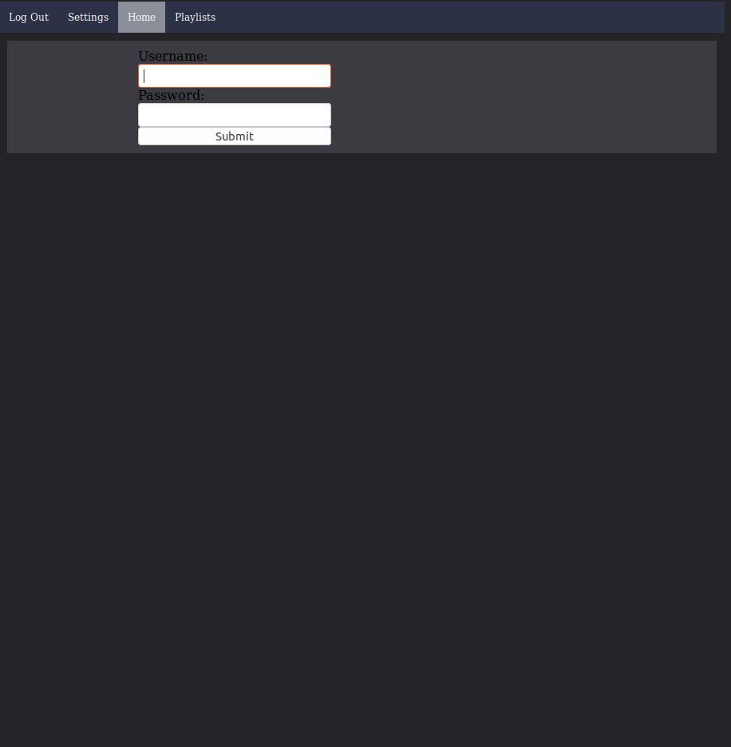
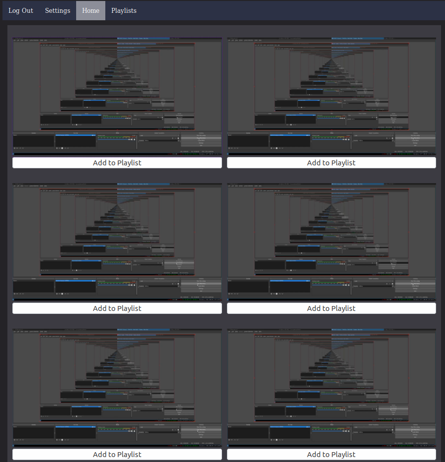

# Hermit
## What is it?
Hermit is a home video server for viewing your videos. It keeps all of your videos and at home 
away from prying eyes (unlike plex). It is designed to be easy to set up and use.
## What platforms is it availible on?
Hermit is tested to work on ubuntu linux and docker. However in theory it shoudl work on windows macos and *nix operating systems.
## Instalation Instructions
The recomended platform is docker. To run on docker type: 


```docker run -p 8443:8443 -v /videos:{VIDEO_DIRECTORY} /home/app_user/db.json:{DATABASE_FILE_PATH} scifi6546/hermit:latest```
to run without ssl encryption:

```docker run -p 8443:8443 -v /videos:{VIDEO_DIRECTORY} /home/app_user/db.json:{DATABASE_FILE_PATH} -e SSL="-ssl no" scifi6546/hermit:latest```
### Building the Repository


To build the project clone this repo and install rust for your operating system.
Next type: 

```cargo run```

and you have built the repo.
## SSL encryption
Hermit automatically runs with ssl encryption at port 8443. to disable ssl encryption run the program
with the arguments -ssl no
## Screenshots:



